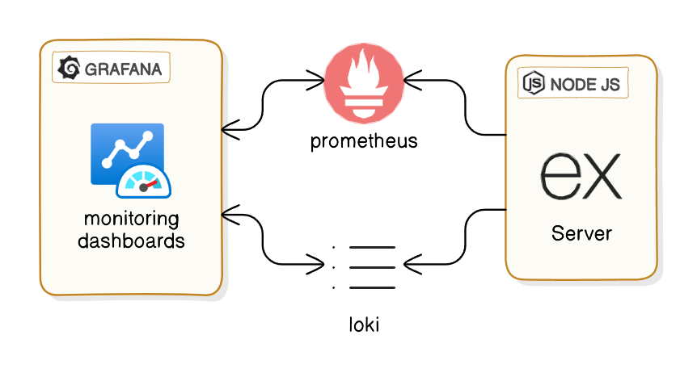

# Monitoring with `Grafana`, `Loki` and `Prometheus`

## Prerequisite
- Basic Knowlege of Node.js and Express Framework
- Basic to Intermediate knowledge in Docker and Containerization - [Learn Docker Containerization](https://learn.piyushgarg.dev/learn/docker)

## Grafana Overview
1. **Grafana Open Source Software (OSS)** enables you to query, visualize, alert on, and explore your metrics, logs, and traces wherever they’re stored. 
  - Grafana data source plugins enable you to query data sources including... 
    - time series databases like Prometheus and CloudWatch
    - logging tools like Loki and Elasticsearch
  - Grafana OSS provides you with tools to display that data on live dashboards with insightful graphs and visualizations.

2. **Grafana Enterprise** is a commercial edition of Grafana that includes exclusive data source plugins and additional features not found in the open source version. 
  - You also get 24x7x365 support and training from the core Grafana team. To learn more about these features, refer to Enterprise features.

## Grafana Loki Overview
Grafana Loki is a set of open source components that can be composed into a fully featured logging stack. 
- A small index and highly compressed chunks simplifies the operation and significantly lowers the cost of Loki.

## Prometheus Overview
Prometheus is an open-source systems monitoring and alerting toolkit originally built at SoundCloud.
- Prometheus collects and stores its metrics as time series data, i.e. metrics information is stored with the timestamp at which it was recorded, alongside optional key-value pairs called labels.

### Simple monitoring architecture


> Video Tutorial: [https://youtu.be/ddZjhv66o_o](https://youtu.be/ddZjhv66o_o)


## Installation and Setup
#### 1. Prometheus Server
- Create a `prometheus-config.yml` file and copy the following configration. Don't forget to replace `<NODEJS_SERVER_ADDRESS>` with actual value.
```yml
global:
  scrape_interval: 4s

scrape_configs:
  - job_name: prometheus
    static_configs:
      - targets: ["<NODEJS_SERVER_ADDRESS>"] # put local IP address in case of local host
```
- Start the Prometheus Server using docker compose
```yml
services:
  prom-server:
    image: prom/prometheus
    ports:
      - 9090:9090
    volumes:
      - ./prometheus-config.yml:/etc/prometheus/prometheus.yml
```
Great, The prometheus server is now up and running at PORT 9090

#### 2. Setup Grafana
```bash
docker run -d -p 3000:3000 --name=grafana grafana/grafana-oss
```


### 3. Setup Loki Server
```bash
docker run -d --name=loki -p 3100:3100 grafana/loki
```

